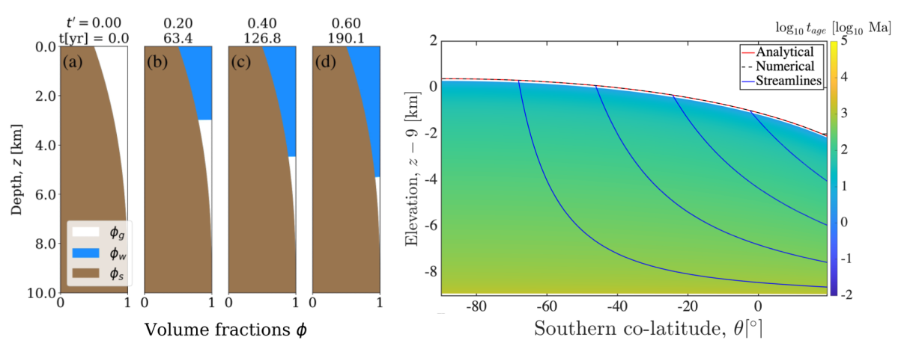

## Course Description

This course will cover the theoretical concepts in subsurface hydrology that include infiltration and groundwater dynamics. The videos will be posted on youtube each Sunday and will be linked here along with the course notes.

[Syllabus](summer2025/Hydro4X_Syllabus_2025.pdf)
 
The course content will be guided by research problems where students will work on conceptual, theoretical and occasionally numerical examples.

### Class room and time
* Lecture will be uploaded on Youtube every Sunday.

### Office hours
*  Mon noon-1pm ET on Zoom ( https://princeton.zoom.us/j/5320572598 ) or schedule via email

### Additional course websites:
* [Google drive for comments](https://piazza.com/class/m5psdq6pfcm372) - Discussion board (need a place for discussion)
* [Matlab Grader](https://grader.mathworks.com/courses/164028-geo-325m-398m-numerical-modeling-2025) - VarSatFlow for homework

<!---<## This years course project>-->
<!---[]<In summer 2025 we will develop a model for>--->

<!---[]<For reference see [[Vance at al. 2020]](papers/Vance2021.pdf)>--->
<!---[]template, does not count
* [Intro slides](spring2025/CourseIntro2025.pdf), [Class project](spring2025/ClassProject_2025.pdf)
* Notes: [Balance Laws](spring2023/BalanceLaws.pdf), [Energy Balance](spring2025/Energy_Balance_Simple.pdf)--->
## Introduction

### Lecture 1: Introduction
* [Intro slides](spring2025/CourseIntro2025.pdf), [Class syllabus](spring2025/ClassProject_2025.pdf)
* Notes: [Water cycle, Volume averaging, Multi-phase flows](spring2023/BalanceLaws.pdf), [Energy Balance](spring2025/Energy_Balance_Simple.pdf)

## Fundamentals of subsurface hydrology

### Lecture 2: Fundamentals of subsurface hydrology I
#### General balance equation derivation, Curvilinear coordinate transformation
* Lecture: [recording](), [board]()
* Notes: [Notes]()

### Lecture 3: Fundamentals of subsurface hydrology II
#### Darcy's experiment, Scaling argument, soil hydraulic parameters
* Lecture: [recording](), [board]()
* Notes: [Notes]()

### Lecture 4: Fundamentals of subsurface hydrology III
#### Derivation and discussion on Richards equation (PDE type, non-dimensionalization), Capillary forces and soil type
* Lecture: [recording](), [board]()
* Notes: [Notes]()

### Lecture 5: Theory of infiltration I
#### Introduction, effects of evapotranspiration and capillarity
* Lecture: [recording](), [board]()
* Notes: [Notes]()

### Lecture 6: Theory of infiltration II
#### Diffusion limit
* Lecture: [recording](), [board]()
* Notes: [Notes]()

### Lecture 7: Theory of infiltration III
#### Kinematic wave limit (hyperbolic PDE, method of characteristics),Effect of subsurface heterogeneity
* Lecture: [recording](), [board]()
* Notes: [Notes]()

### Lecture 8: Theory of infiltration IV
#### Green-Ampt approach
* Lecture: [recording](), [board]()
* Notes: [Notes]()

### Lecture 9: Theory of perching
* Lecture: [recording](), [board]()
* Notes: [Notes]()

### Lecture 10: Theory of groundwater dynamics I
#### Introduction to types of aquifer: confined and unconfined, High vs low aspect ratio aquifers and seepage face
* Lecture: [recording](), [board]()
* Notes: [Notes]()

### Lecture 11: Theory of groundwater dynamics II
#### Derivation of vertically integrated groundwater model, Analytic solutions of quasi-two-dimensional, unconfined aquifers: steady drainage, sudden rainfall, late-stage drainage
* Lecture: [recording](), [board]()
* Notes: [Notes]()

### Lecture 12: Theory of groundwater dynamics III
#### Streamfunction, potential function, and groundwater age
* Lecture: [recording](), [board]()
* Notes: [Notes]()

### Lecture 13: Advanced topics in subsurface hydrology I
#### Snow/firn hydrology (inclusion of thermodynamics)
* Lecture: [recording](), [board]()
* Notes: [Notes]()

### Lecture 14: Advanced topics in subsurface hydrology I
#### Coupled subsurface hydrology and reactive-transport modeling
* Lecture: [recording](), [board]()
* Notes: [Notes]()

### Lecture 15: Class review & Discussion

  
